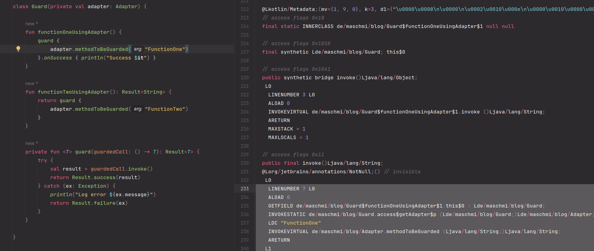
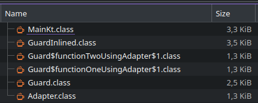
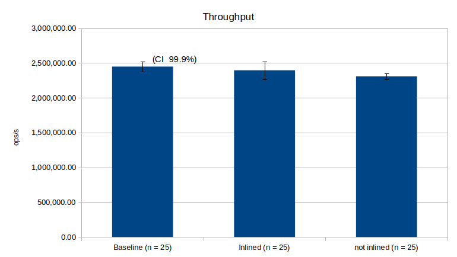

# Inlined Kotlin

At work, we started a new project using Kotlin instead of Java to write SpringBoot code. This makes me
a rather happy developer. While the switch from writing and reading Java to writing and reading Kotlin
was easy - for the whole team - there may be features Java does not have, but Kotlin does have.

One of these features is to mark a function as `inline`. If we look at the [documentation](https://kotlinlang.org/docs/inline-functions.html)
it states 

> The inline modifier affects both the function itself and the lambdas passed to it: all of those will be inlined into the call site.
>
> Inlining may cause the generated code to grow. However, if you do it in a reasonable way (avoiding inlining large functions), it will pay off in performance, especially at "megamorphic" call-sites inside loops."

While the documentation contains some examples and is helpful, for me, I have to see things sometimes
with my own eyes. Especially if I'm undecided whether to use `inline` in some case or not. And as I do have a day off and
am curious, lets dive into this.

## The guard

I wanted to solve an issue in the code at work which looks like the following:

* call an external service
* this call may fail with some exception
* if the call fails, just log the exception but keep running
* do not rethrow the exception

As I had to do not only one but many calls and wanted not to wrap each call into a try/catch-block
of its own, I implemented a guard.

```Kotlin
private fun <T> guard(guardedCall: () -> T): Result<T> {
    try {
        val result = guardedCall.invoke()
        return Result.success(result)
    } catch (ex: Exception) {
        return Result.failure(ex)
    }
}
```

This code does take some function returning a T. As return type it leverages the
kotlin Result-Type which either may take success or a failure. The failure must be of type
Throwable. This was appealing to me, as I do like Either-Types like Result and also the
calling function can still decide how to proceed with an error or a success.

The calling method may look something like this:

```Kotlin
fun functionOneUsingAdapter() {
    guard {
        adapter.methodToBeGuarded("FunctionOne")
    }.onSuccess { println("Success $it") }
}
```

So far, so good. This works and is neither hard to read nor awesome code. Coming from Java and
poking around in bytecode sometimes (and also reading the inline documentation), I really would like
to check if we can live without the anonymous lambda and virtual calls.

## The inlined guard

Time to inline the guard:

```Kotlin
private inline fun <T> inlinedGuard(guardedCall: () -> T): Result<T> {
    try {
        val result = guardedCall.invoke()
        return Result.success(result)
    } catch (ex: Exception) {
        return Result.failure(ex)
    }
}
```

and use it like this:

```Kotlin
fun functionOneUsingAdapter() {
    inlinedGuard {
        adapter.methodToBeGuarded("FunctionOne")
    }.onSuccess { println("Success $it") }
}
```

Unsurprisingly, the code still does the same.

## The bytecode

Time to look at the bytecode. If you use IntelliJ double press `shift`, search for `bytecode` and select `Show Kotlin Bytecode`.

This is a quite awesome tool as it will show the bytecode in a new view and even update it as soon
as you change the source code. If you need to look up some bytecode instructions (like I have to do), I do find the
[wikipedia](https://en.wikipedia.org/wiki/List_of_Java_bytecode_instructions) rather helpful. Another helpful tool is
the [jclasslib Bytecode Viewer](https://plugins.jetbrains.com/plugin/9248-jclasslib-bytecode-viewer) plugin.

Let's see what happens if the not inlined guard is used:

[You can find the complete bytecode for the not inlined guard here](../assets/kotlin-inlined/not_inlined_bytecode.txt). I will only
 copy a little in here.

In line 34 we can find our `functionOneUsingAdapter` body:

```
 [...]
 34 public final functionOneUsingAdapter()V
 35  L0
 36   LINENUMBER 6 L0
 37   LINENUMBER 8 L0
 38   LINENUMBER 6 L0
 39   ALOAD 0
 40   NEW de/maschmi/blog/Guard$functionOneUsingAdapter$1
 41   DUP
 42   ALOAD 0
 43   INVOKESPECIAL de/maschmi/blog/Guard$functionOneUsingAdapter$1.<init> (Lde/maschmi/blog/Guard;)V
 44   CHECKCAST kotlin/jvm/functions/Function0
 45   INVOKESPECIAL de/maschmi/blog/Guard.guard-IoAF18A (Lkotlin/jvm/functions/Function0;)Ljava/lang/Object;
 46   ASTORE 1
 [...]
```

In line 40, some NEW objects are created. The address is then duplicated 
on the stack, then it loads a reference from a local variable onto the stack. After this, it calls
INVOKESPECIAL to init the newly created object, checks the type and finally
calls the guard method with the created object as argument. Then it stores the result of this call in a local variable.

Quite a lot to do, right? But we are not yet finished.

Starting in line 207, we can find this:

```
[...]
final class de/maschmi/blog/Guard$functionOneUsingAdapter$1 extends kotlin/jvm/internal/Lambda implements kotlin/jvm/functions/Function0 {

  // compiled from: Guard.kt
  OUTERCLASS de/maschmi/blog/Guard functionOneUsingAdapter ()V

  @Lkotlin/Metadata;(mv={1, 9, 0}, k=3, d1={"\u0000\u0008\n\u0000\n\u0002\u0010\u000e\n\u0000\u0010\u0000\u001a\u00020\u0001H\n\u00a2\u0006\u0002\u0008\u0002"}, d2={"<anonymous>", "", "invoke"})
  // access flags 0x18
  final static INNERCLASS de/maschmi/blog/Guard$functionOneUsingAdapter$1 null null
  [...]
  public final invoke()Ljava/lang/String;
  @Lorg/jetbrains/annotations/NotNull;() // invisible
   L0
    LINENUMBER 7 L0
    ALOAD 0
    GETFIELD de/maschmi/blog/Guard$functionOneUsingAdapter$1.this$0 : Lde/maschmi/blog/Guard;
    INVOKESTATIC de/maschmi/blog/Guard.access$getAdapter$p (Lde/maschmi/blog/Guard;)Lde/maschmi/blog/Adapter;
    LDC "FunctionOne"
    INVOKEVIRTUAL de/maschmi/blog/Adapter.methodToBeGuarded (Ljava/lang/String;)Ljava/lang/String;
    ARETURN
   L1
    LOCALVARIABLE this Lde/maschmi/blog/Guard$functionOneUsingAdapter$1; L0 L1 0
    MAXSTACK = 2
    MAXLOCALS = 1
 
  // access flags 0x0
  <init>(Lde/maschmi/blog/Guard;)V
    ALOAD 0
    ALOAD 1
    PUTFIELD de/maschmi/blog/Guard$functionOneUsingAdapter$1.this$0 : Lde/maschmi/blog/Guard;
    ALOAD 0
    ICONST_0
    INVOKESPECIAL kotlin/jvm/internal/Lambda.<init> (I)V
    RETURN
    MAXSTACK = 2
    MAXLOCALS = 2
}
[...]
```

This is our lambda function and also the new object created in line 40. By the way, we can also see these inner classes
as extra class files on the file system. More about this later. And we did not event look at the guard itself.

But what will the inlined version look like? Again we only will look at some details, [you can find the complete bytecode for
the inlined guard here](../assets/kotlin-inlined/inlined_bytecode.txt). 

```
[...]
 36 public final functionOneUsingAdapter-d1pmJ48()Ljava/lang/Object;
 37 @Lorg/jetbrains/annotations/NotNull;() // invisible
 38   TRYCATCHBLOCK L0 L1 L1 java/lang/Exception
 39  L2
 40   LINENUMBER 6 L2
 41   ALOAD 0
 42  ASTORE 1
 43  L3
 44   ICONST_0
 45   ISTORE 2
 46  L0
 47   LINENUMBER 28 L0
 48   NOP
 49  L4
 50   LINENUMBER 29 L4
 51   ICONST_0
 52   ISTORE 3
 53  L5
 54   LINENUMBER 7 L5
 55   ALOAD 0
 56   GETFIELD de/maschmi/blog/GuardInlined.adapter : Lde/maschmi/blog/Adapter;
 57   LDC "FunctionOne"
 58   INVOKEVIRTUAL de/maschmi/blog/Adapter.methodToBeGuarded (Ljava/lang/String;)Ljava/lang/String;
 59  L6
 60   LINENUMBER 29 L6
 61   ASTORE 4
 [...]
```

In line 36 your `functionOneUsingAdapter` with the inlined guard can be found. In line 37, we can directly
see the first change. We can see a `TRYCATCHBLOCK`. Reading more of the bytecode we cannot see a new object
generation, no invokes up to line 58 where we do an `INVOKEVIRTUAL` of the external method. To mee this code looks a lot
better readable, fewer indirections and also shorter. 

Wow, I do like inline. It may make the code bigger by copying the bytecode of lambdas into the inline function and the inlined
function itself into the caller method body, but this does feel great.

## The size

If you remember the documentation quote from the beginning:

> Inlining may cause the generated code to grow.

Did the code grow in this case? To test this, I've added two methods using the guards. Guards and methods are defined in
the same class.

 

There are a lot of files, we can ignore `MainKt.class` and `Adapter.class` and only look
at `GuardInlined.class` and `Guard.class`, `Guard$functionOneUsingAdapter$1.class` and `Guard$functionTwoUsingAdapter$1.class`.
While the inlined guard resulted in one class file with a size of 3.5 KiB, the not inlined guard resulted in three files with a total
of 5.1 KiB. But why three files? Two of the files, the ones with a `$` in the names contain the bytecode for the inner classes 
seen discussed in the section above.

Inlining the guard made our code even smaller. Wow. I did not expect that when reading the warning in the documentation. However, this may be a special
case when the inline function is in the same class as the functions using it. I will not look deeper into this.

## Performance

Out of curiosity, can we see performance differences? I'm not a benchmarking expert. But let's give it a go.
To do this, I removed all the print statements from the methods and let the functions using the guard return its result. The
benchmarking code itself uses JMH () and looks like this:

```Kotlin
@State(Scope.Benchmark)
open class Benchmarks {

    private val adapterForInline = Adapter()
    private val guardInlined = GuardInlined(adapterForInline)

    private val adapterForNotInline = Adapter()
    private val guard = Guard(adapterForNotInline)

    private val adapter = Adapter()

    @Benchmark
    fun baseline(blackhole: Blackhole) {
        try {
            blackhole.consume(adapter.methodToBeGuarded("test"))
        } catch (ex: RuntimeException) {
            blackhole.consume(ex)
        }
    }

    @Benchmark
    fun inlined(blackhole: Blackhole) {
        val result = guardInlined.functionTwoUsingAdapter()
        blackhole.consume(result)
    }

    @Benchmark
    fun notInlined(blackhole: Blackhole) {
        val result = guard.functionTwoUsingAdapter()
        blackhole.consume(result)
    }
}
```
As I said, I'm not a benchmarking expert. If you have some comments, write me a [mail](https://blog.maschmi.net/about) or contact me on [LinkedIn](https://www.linkedin.com/in/martin-schmidt-74b9b727b/).
The settings to run the benchmark were the default settings, measuring ops/s and doing 5 warmup iterations, 
5 measurements iterations and 5 forks (25 measurements in total per benchmark).

By looking at the bytecode I expect a (small) difference. However, bytecode will be optimized by the JIT at some
time. And we do a lot of passes. Looking into the JITed code may be interesting, but this may be a topic of another post.

Here are the results:

| Benchmark | Mode | Cnt | Score | Error        | Units |
| --- | --- | --- | --- |--------------|-------|
| Benchmarks.baseline | thrpt | 25 | 2447820.380 | ± 75580.128  | ops/s |
| Benchmarks.inlined | thrpt | 25 | 2395025.994 | ± 126472.930 | ops/s |
| Benchmarks.notInlined | thrpt | 25 | 2307054.098 | ± 39492.006  | ops/s |

Or if you like it as chart:



Without doing the math for the statistics, by only looking at the error bars for the CI of 99.9% it does not look
like a significant difference between inline and notInlined guards. But this may be a result of me not knowing how to benchmark.
Please take this results with a grain of salt.

## The code

You can find the code in this [respository](https://github.com/maschmi/blog-ktinline).

## Conclusion

I will add the inline keyword to the guard, first thing next workday. I did find this journey interesting and a bit
enlightening. I hope you did as well.