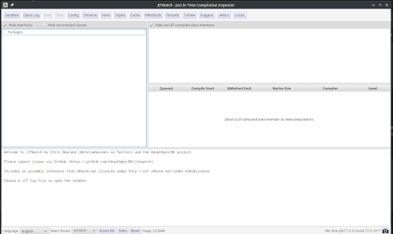
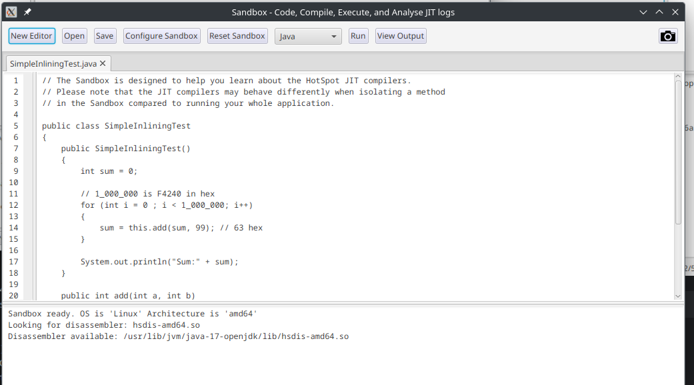
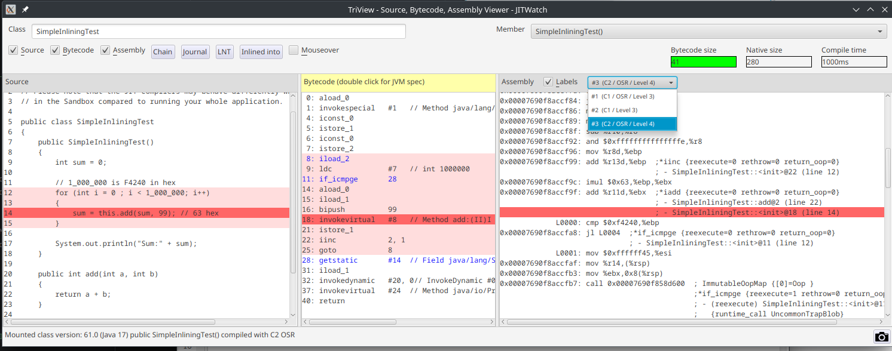
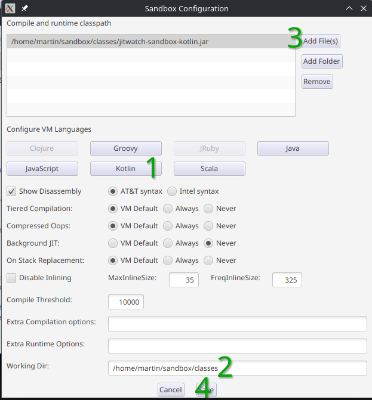
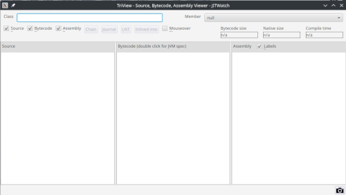
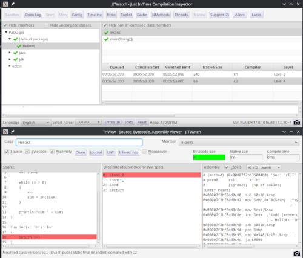

I'm quite sure I do not have to tell you the bytecode from your favorite JVM based programming language
is eventually converted to assembly. I also will not tell you why and how and when
this bytecode is transformed to native code. There are great resources out there. However, we will start at one
of these resources and setup [JITWatch](https://github.com/AdoptOpenJDK/jitwatch) in the process to be able to view native code ourselves.

In the process of this HowTo we will learn:

* How to create assembly from Bytecode with the `java`
* Install HSDIS (hotspot disassembler) to get opcodes
* Install JITWatch
* Configure JITWatch to be used with Kotlin code

## Viewing assembly code

There are multiple ways of viewing assembly code produced by the JIT. One of the easies one is to use `java` with
[special flags](https://github.com/AdoptOpenJDK/jitwatch/wiki/Instructions). Just run your java code with

```
java -XX:+UnlockDiagnosticVMOptions -Xlog:class+load=info -XX:+LogCompilation -XX:+PrintAssembly -XX:+DebugNonSafepoints 
``` 

and it will generate assembly to stdout. However, this assembly may look strange and you will not see human-readable
opcodes. This is because HSDIS is most likely missing. So if you see something like this

```
[MachCode]
[Entry Point]
  # {method} {0x00007ce9fb000510} '<init>' '()V' in 'java/lang/Object'
  #           [sp+0x40]  (sp of caller)
  0x00007cea390001a0: 448b 5608 | 49bb 0000 | 0000 0800 | 0000 4d03 | d34c 3bd0

  0x00007cea390001b4: ;   {runtime_call ic_miss_stub}
  0x00007cea390001b4: 0f85 c67b | 5807 660f | 1f44 0000
```

read on.

## Installing HSDIS

HSDIS is the hotspot disassembler binary and can either be [built](https://github.com/AdoptOpenJDK/jitwatch/wiki/Building-hsdis) or
[downloaded](https://chriswhocodes.com/hsdis/) (thank you, [Chris Newland](https://github.com/chriswhocodes)). The [download site](https://chriswhocodes.com/hsdis/)
also tells you how to tell your OS where to find the binary. One of the easiest ways is to copy it directly into your JDK distribution `$JDK_HOME%/lib/hsdis-<arch>.<extension>`.
For me this would be `/usr/lib/jvm/java-17-openjdk/lib/hsdis-amd64.so`. Or set it as environment variable in Linux/MaxOS or copy it to a directory included in the PATH on Windows.

With this installed, we should see assembler opcodes in stdout.

```
[Entry Point]
  # {method} {0x00007c63cf000510} '<init>' '()V' in 'java/lang/Object'
  #           [sp+0x40]  (sp of caller)
  0x00007c640d0001a0:   mov    0x8(%rsi),%r10d
  0x00007c640d0001a4:   movabs $0x800000000,%r11
  0x00007c640d0001ae:   add    %r11,%r10
  0x00007c640d0001b1:   cmp    %rax,%r10
  0x00007c640d0001b4:   jne    0x00007c6414587d80           ;   {runtime_call ic_miss_stub}
  0x00007c640d0001ba:   nopw   0x0(%rax,%rax,1)
```

Way better, right? But how to make sense of this without having to read too much assembly code?

## JITWatch

[JITWatch](https://github.com/AdoptOpenJDK/jitwatch) is a project started and sponsored by [Chris Newland](https://github.com/chriswhocodes).
I first came to hear about this tool last year when diving into java bytecode and what comes after. There are [slides](https://www.chrisnewland.com/images/jitwatch/HotSpot_Profiling_Using_JITWatch.pdf)
and a [video](https://youtu.be/p7ipmAa9_9E?feature=shared) introducing the tool.

Basically, the tool will allow you to either use a hotspot log to analyze the JVM and the JIT process or to use the sandbox. Honestly,
I always use the sandbox as I can use smaller examples there, which reduces the complexity to fit in my head without too much effort.

[Just download JITWatch](https://github.com/AdoptOpenJDK/jitwatch/releases) save the JAR on your disk, make sure you have HSDIS installed
and start it with `java -jar jitwatch-ui-<release>.jar`. Now you will be greeted by a UI window



But how to check if it works? If you open the sandbox you should see the `SimpleInliningTest.java` opened. But where does this come from?
Remember the JAR downloaded? Inside there are some examples. They are extracted to your current working dir into a folder named sandbox. 
Your current working dir is the directory you have invoked `java` from to start JITWatch.



But how to get to some assembly and bytecode? Just press `Run` on the upper bar. You then will be greeted with a three pane view
showing source code, bytecode and assembly code from different tiers of the JVM.

.

Now you can take your time to explore how source code, bytecode and assembly code come together. My most favourite feature is
how JITWatch allows you to select a source code line, highlight the bytecode and then highlight the assembly code if there is
any. The compiler and the JIT may have optimized some calls out. So do not be alarmed if you cannot see some lines you would have
expected in the bytecode or the assembly code. You also can select different Tiers from a dropdown over the assembly pane. Again, there may
or may not be more than one option. It all depends on the code you are analyzing.

## Analyzing Kotlin Code

The main reason I looked into JITWatch again was to have a look at the `inline` keyword in Kotlin. Can JITWatch be used to 
analyze Kotlin code as well? Of course, it can, but not right out of the box.

To get started, open the Sandbox, press `Open` and select `hello.kt` from the examples. Then press `Run` and the log will
tell you `Kotlin compiler path not set. Please click Configure Sandbox and set up the path.`. Now press `Configure Sanbbox`.



We now have to set

1. The path to the Kotlin compiler
2. Set the working dir
3. Add a special jar file named `jitwatch-sandbox-kotlin.jar` to the Compile and Runtime classpath
4. Save the changes

If you cannot see the save button just increase the height of the dialog. It took me a while to spot this.

In my case (Linux and starting JITWatch from the home folder), I had to set

* Kotlin compiler to: `$HOME/.local/share/JetBrains/Toolbox/apps/intellij-idea-ultimate/plugins/Kotlin/kotlinc`
* Working Dir: `$HOME/sandbox/classes` 
* Compile and Runtime Classpath add file: `$home/sandbox/classes/jitwatch-sandbox-kotlin.jar`

where $HOME is the path to my home directory. This most likely will differ in your case. You will get `Error: Unable to access jarfile jitwatch-sandbox-kotlin.jar`
if your working dir is not set.

Why do we need to set the path to the `jitwatch-sandbox-kotlin.jar`? Well, without it you will not see the JITed Kotlin code. This has something to do with
how the kotlin compiler creates inner classes and how [JITWatch works](https://groups.google.com/g/jitwatch/c/id_IoyTOxmQ).

Now press `Run` again. You will be greeted with an empty TriView



Where is the code? Again, this has to do with inner classes and Kotlin having a main function and not a main class. Now you have to options.
Either enter `HellKt` in the `Class` input box in the TriView or open the main window of JITWatch, select `default package` and navigate using 
this. The TriView will be updated.



Now have fun diving into bytecode, assembly and things!


