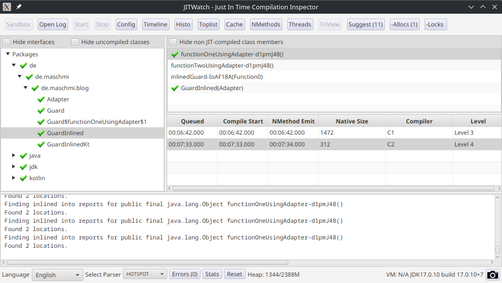
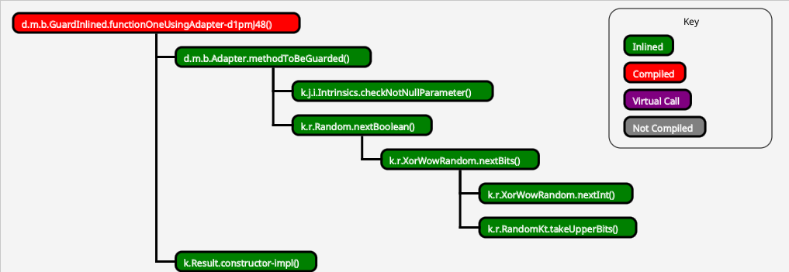
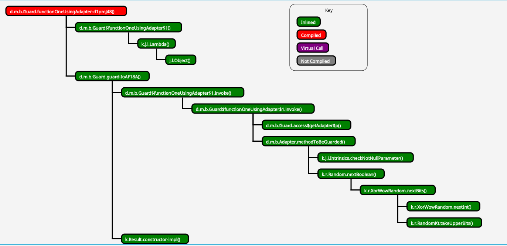
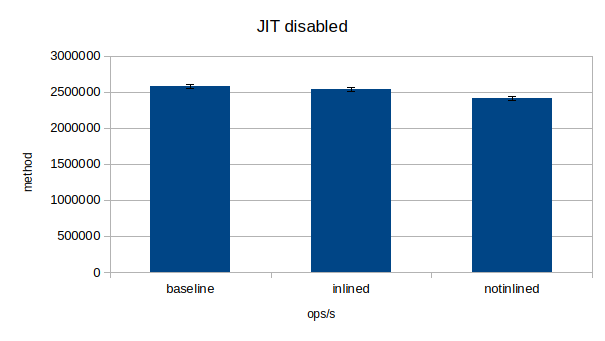

Do you remember my [investigations into the inline keyword](https://blog.maschmi.net/KotlinInline/)? The bytecode
of the inlined guard was much shorter and easier to read compared to the not inlined one. Nevertheless, benchmarking
the code using [JMH](https://github.com/openjdk/jmh) did not show a performance gain. I have already hinted at the end
of the article looking into the JIT may be interesting. It took some time, while I figured out (again) how to use JitWatch and this time
writing a [small howto setup JitWatch](https://blog.maschmi.net/JitWatch/) but here we are.

## The setup

We use basically the same code as in the first article. You can find it [here](https://github.com/maschmi/blog-ktinline).
However, we need to adapt it a bit for using it with JitWatch. I copied `Adatper.kt`, `Guard.kt` and `GuardInlined.kt` to 
my sandbox directory of JitWatch and used the configuration from before. This time, I opened the sandbox and
created three editor windows by pressing `New Editor` and opened all three files. 

It is important to have at least the `Adapter.kt` file and the Guard you want to have a look at open at the same time. 
If not, the compiler will not find the Adapter class and fail.

To get the code compiled and analyzed by the JIT we need to run it a couple of times to overcome the threshold to be considered `hot`. We can put something like this


```kotlin
fun main() {
    for(i in 0..50000) {
        val g = GuardInlined(Adapter())
        g.functionOneUsingAdapter()
    }
    for(i in 0..50000) {
        val g = Guard(Adapter())
        g.functionOneUsingAdapter()
    }
}
```

on top of the `GuardInnlined.kt` class in the editor of the sandbox. Now we can run it and be sure the methods
are called plenty of times - I think the default threshold is 10000 times for a method to even get considered for compiling.

## The results

We are greeted with an empty TriView and some packages to select from in the main window of JitWatch. 



From there on, navigation is easily possible. First, let's see what the TriView has to offer without looking
at the assembly. Personally I did find the `Chain` view quite informative. To get to it, select either the `GuardInlined` or the `Guard` package
in the main windows and then select the functionOneUsingAdapter in the class members field. You should have a green checkmark to the method name
in both guards. In the TriView press the `Chain` button.

First, let us look at the guard with the inline keyword in it.



All the methods were inlined into the compiled code! As expected, I would say.

Now, for the other guard. The one we did not explicitly told the compiler to inline. The one with the much more complex bytecode.



Again. All the code is compiled and inlined. However, we do find something strange at the top. We do see the inlined lambda, further
we see some invoking on the lambda.

Diving deeper into the code we can find for the inlined guard

```
0x000077505ccd4048:   sub    $0x10,%rsp                   ;*synchronization entry
                                                            ; - de.maschmi.blog.GuardInlined::functionOneUsingAdapter-d1pmJ48@-1 (line 17)
0x000077505ccd404c:   mov    0xc(%rsi),%r10d              ;*getfield adapter {reexecute=0 rethrow=0 return_oop=0}
                                                          ; - de.maschmi.blog.GuardInlined::functionOneUsingAdapter-d1pmJ48@8 (line 18)
0x000077505ccd4050:   mov    0xc(%r12,%r10,8),%r10d       ; implicit exception: dispatches to 0x000077505ccd4104
                                                          ;*getfield rnd {reexecute=0 rethrow=0 return_oop=0}
                                                          ; - de.maschmi.blog.Adapter::methodToBeGuarded@7 (line 10)
                                                          ; - de.maschmi.blog.GuardInlined::functionOneUsingAdapter-d1pmJ48@13 (line 18)
0x000077505ccd4055:   mov    0x8(%r12,%r10,8),%r8d        ; implicit exception: dispatches to 0x000077505ccd4110
0x000077505ccd405a:   cmp    $0x1280,%r8d                 ;   {metadata('kotlin/random/XorWowRandom')}
0x000077505ccd4061:   jne    0x000077505ccd40ea
[....] if the cmp succeeds there are no call instructions till the ret
0x000077505ccd40e9:   ret
```

and 

```
0x000077505ccd5e48:   sub    $0x10,%rsp                   ;*synchronization entry
                                                          ; - de.maschmi.blog.Guard::functionOneUsingAdapter-d1pmJ48@-1 (line 9)
0x000077505ccd5e4c:   mov    0xc(%rsi),%r10d              ;*getfield adapter {reexecute=0 rethrow=0 return_oop=0}
                                                          ; - de.maschmi.blog.Guard::access$getAdapter$p@1 (line 6)
                                                          ; - de.maschmi.blog.Guard$functionOneUsingAdapter$1::invoke@4 (line 10)
                                                          ; - de.maschmi.blog.Guard$functionOneUsingAdapter$1::invoke@1 (line 9)
                                                          ; - de.maschmi.blog.Guard::guard-IoAF18A@2 (line 22)
                                                          ; - de.maschmi.blog.Guard::functionOneUsingAdapter-d1pmJ48@12 (line 9)
0x000077505ccd5e50:   mov    0xc(%r12,%r10,8),%r10d       ; implicit exception: dispatches to 0x000077505ccd5f04
                                                          ;*getfield rnd {reexecute=0 rethrow=0 return_oop=0}
                                                          ; - de.maschmi.blog.Adapter::methodToBeGuarded@7 (line 10)
                                                          ; - de.maschmi.blog.Guard$functionOneUsingAdapter$1::invoke@9 (line 10)
                                                          ; - de.maschmi.blog.Guard$functionOneUsingAdapter$1::invoke@1 (line 9)
                                                          ; - de.maschmi.blog.Guard::guard-IoAF18A@2 (line 22)
                                                          ; - de.maschmi.blog.Guard::functionOneUsingAdapter-d1pmJ48@12 (line 9)
0x000077505ccd5e55:   mov    0x8(%r12,%r10,8),%r8d        ; implicit exception: dispatches to 0x000077505ccd5f10
0x000077505ccd5e5a:   cmp    $0x1280,%r8d                 ;   {metadata('kotlin/random/XorWowRandom')}
0x000077505ccd5e61:   jne    0x000077505ccd5eea
[....] if the cmp succeeds there are no call instructions till the ret
0x000077505ccd5ee9:   ret
```

for the not inlined guards. I've put both methods into a compare tool, beside some extra lines du to annotations, and of course
the instruction addresses they are identical! No wonder there were no differences! By the way, you do not have to trust me,
you can [download the whole assembly code](../assets/jit-inline/assembly.asm).

I must say I'm quite impressed by the JIT. This somehow poses the question when to inline and when not? For hot methods it may not
be needed. But still, it makes the bytecode more streamlined, eliminates the need for `invokevirtual` calls, produces less class files
and may be helpful on methods not yet running hot and getting a premier JIT treatment.

## The effect of JIT

For "science", we can retry the benchmark from [Kotlin Inline](https://blog.maschmi.net/JitWatch/), but this time disabling the JIT by adding `-XX:CompileCommand=exclude,de.maschmi.blog.*` to 
the java options when starting the benchmark. This disables compilation for the code we want to benchmark. 

Here are the results:

| Benchmark | Mode | Cnt | Score       | Error | Units |
| --- | --- | --- |-------------|--------------|-------|
| Benchmarks.baseline | thrpt | 25 | 2580164.266 | ± 24825.033 | ops/s |
| Benchmarks.inlined | thrpt | 25 | 2533414.605 | ± 28436.612 | ops/s |
| Benchmarks.notInlined | thrpt | 25 | 2409256.134 | ± 28750.091 | ops/s |


Or if you like it as chart:



No big difference, but this time it looks like there is one between the inlined and the not inlined code. Please do
not compare the actual total ops/s from the old article and this one. While the hardware is the same, the system I'm using
had some software updates and also the overall load may be a bit different.