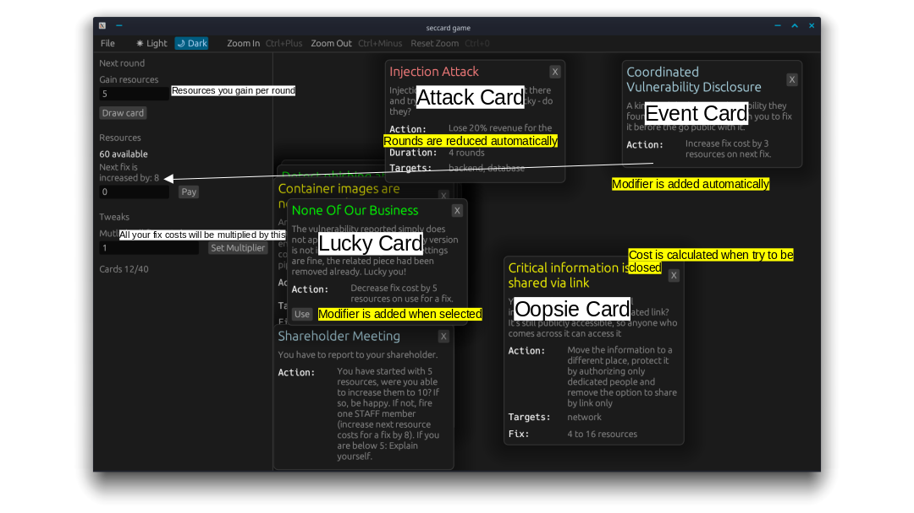
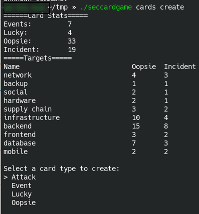

As written [in](https://blog.maschmi.net/seccardgame/) there is a tooling for the SecCardGame allowing you to contribute cards or play the
game and come up with some new rules and mechanism. We ([Philipp](https://www.linkedin.com/in/philipp-zug-a892161b/), [Lisi](https://de.linkedin.com/in/lisihocke) and me) are using this tooling
to get a better grasp on how the game mechanics should be. This article will talk a bit about the history
of the tooling and much more on how to use it. But first, grab you copy [here](https://github.com/Security-Card-Game/seccardgamecli/releases).

## The history

Developing a card game remotely and also as people in the software engineering field needs tooling - at least I think so.
The first need arises by having the [cards](https://github.com/Security-Card-Game/securityDeckGame) in a machine-readable format. However,
writing into such a format as a human may be hard. So the idea was born to have a simple tool to create the cards.
My decision was to do this in Rust, set up a github release workflow building binaries for Linux, Windows and Mac. 
You may ask: Why Rust. Well I wanted to learn it anyway and doing something useful with it helps me in learning it.

The CLI was created with Clap and Dialoguer. And it was a rather pleasant experience. AI helped a bit
in getting familiar with lifetimes and stuff. Now we created cards. Having cards lead to the next issue. How to play the game?
Of course, we could simply copy the cards to a Mural board or something. But to me this felt tedious. So again my curiosity
got the best of me and I added some GUI to the tooling. This time using egui as a framework. This was less pleasant as
I spent the last year mostly wiht HTML and CSS if it came to a GUI. But this also worked soonish and allowed
us to play the game for the first time by screen sharing.

After the first rounds we made some adjustments to the mechanics and again, for me time came to formalize some of the
mechanisms into code. This lead to a major refactoring and a strange mixture of automatic actions and manual actions. After all
I wanted to keep the GUI flexible enough to experiment with the mechanics. And here we are, at the time of writing version
0.5.1 was released.

## How to play

Download your copy of the [game](https://github.com/Security-Card-Game/seccardgamecli/releases). A word of warning: On Windows
sometimes WindowsDefender triggers - if you do not feel brave feel free to upload the binary to some scanning websites or
build it yourself from source. I never had the opportunity to test it on a MacOs as I do not own a Mac.

If you have your copy:

1. Extract the binary
2. Open a terminal
3. Run `seccardgame init` - this downloads the cards into a game directory and creates a config file
4. Run `seccardgame game play` - you will be asked for the amounts of cards for each type, feel free to enter your own numbers. Oopsies should be the most prevaltent card type.
5. You now will be greeted by the UI

In the above screenshot you see text with white and yellow background. The white background is
for explanation. The yellow describes some automatics the game already implements.

You can close any card any time. Except Oopsies. If you close them the fix cost will be determined by 
randomly selecting a value between mai and max and taking into consideration other modifiers as well. Some Lucky Cards
can be activated by a "Use" button (and deactivated). All fix cost modifying cards will be closed after use. If you
cannot pay the fix costs your resources will be gone and the Oopsie stays open.

You must set the resource gain per round manually - also apply any attack effect manually. Also, you can
pay any amount of resources you need.

The Tweak section allows you to modify any fix costs (and any modifying card) by a multiplier. Therefore, you do not
have to change all the base values for fix costs and modifiers in the cards if you need a higher resource income per round
to make some math work. After all 20% from 3 is quite hard to express in an integer.

## How to create a card

Download your copy of the [game](https://github.com/Security-Card-Game/seccardgamecli/releases). A word of warning: On Windows
sometimes WindowsDefender triggers - if you do not feel brave feel free to upload the binary to some scanning websites or
build it yourself from source. I never had the opportunity to test it on a MacOS as I do not own a Mac.

If you have your copy:

1. Extract the binary
2. Open a terminal
3. Run `seccardgame init` - this downloads the cards into a game directory and creates a config file
4. Run `seccardgame cards create` - follow the instructions

You will be greeted with some stats about the already existing cards. Including the count of Oopsies and Attacks 
(for historical reasons there are still called incidents - I've just created an issue for this) having a specific target.

In theory, you will have the opportunity to edit cards before saving them. This may not work well on Windows. 

## Found and Issue, want to contribute?

Just head over to the [github project](https://github.com/Security-Card-Game/seccardgamecli) and either file an issue, fix one, open a PR or comment. 