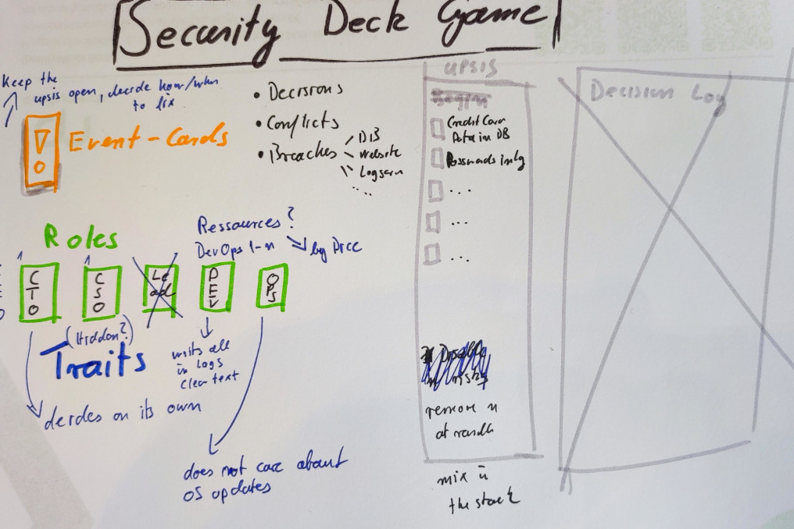
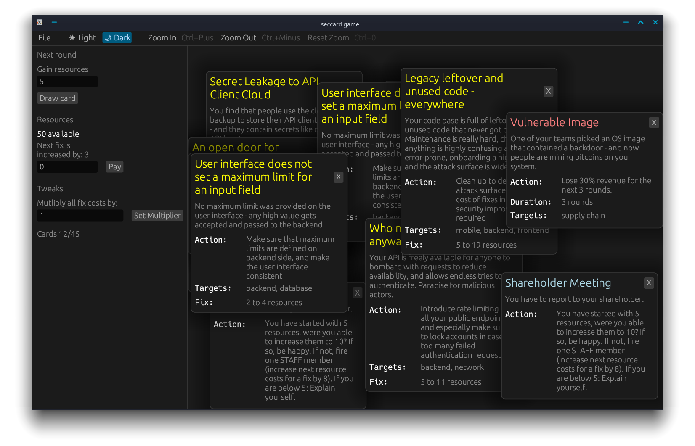

Last year at SoCraTes in Soltau [Philipp](https://www.linkedin.com/in/philipp-zug-a892161b/), [Lisi](https://de.linkedin.com/in/lisihocke) and me had an idea on an 
open-source card game about security. While we set up a repository to collect cards right
away and also had a first grasp on what the game could look like rather fast, it took a while
to get started. Thank you Lisi for the much needed poke later in 2023. Now, a few months
later it has progressed far enough to write about it. And here we are.

## The idea

In the picture above, you can see the first idea we came up during lunch on the last day of the
conference. The idea was and is to create a game in which we all can share our security oopsies, while
keeping it fun. We wanted a game in which we learn from each other and maybe even create some empathy for
different roles in a project. And we also wanted to create a game were you, as a group, need to defeat the
game.

### The context

Imagine you are part of a team working in any company. Your team works in the software development
department. During your development process, you most certainly will create some security issues, 
either in your software or someone else in the company will. We call them Ooopsie. Other events may happen, you may
get lucky with some things, and of course there will be attacks on you. Your job is to not let turn too many
attacks into incidents - or at least not in incidents killing your business. Did I mention you 
need to take care of your resources as well?

### The Roles

Ideally, you are at least three players. One of you will have a C-level role and may decide how they
send resources down to the 'workers', may have the last word in a decision or micromanage all the decisions
the team takes. It is totally up to you. These are roles you can see in the picture above.

But that is not all. Only because you would fill a role in a specific way the game may give you a **trait** you
have to play. E.g., you are forced as a C-level to only allow a certain number of resources allocated to the
'workers'. Or as a 'worker' you may be an inside threat actor leading everybody astray.

### The Game

The game is played in rounds. Every round you will get a certain amount of resources. Then draw a card and
follow the cards instructions. Oopsie-, Event- and Lucky-cards are kept. Attack cards need to be evaluated.
If you have an Oopsie having the same target as an attack, the attack strikes and turns into an incident. 
You are allowed to spend resources on fixing oopsies - one per round. But beware, there may be share-holder meetings.

### How to defeat the game

Well, we are still fuzzy on this. It may be needed to gather a specific amount of resources. Or to simply 
survive the game.

## The current state of the Game

We played the game a couple of times now. And we have some preliminary rules ready.

### The preliminary rules
  
1. Collect your resources for the round
2. Draw a card openly
   * Event, Oopsies and Lucky cards are kept on the board
   * Attack cards are evaluated, if there is a matching target the attack strikes. However, there may be cards allowing you to stop the attack immediately.
3. Close Oopsies
   * Each Oopsie has a range of fix cost, you need to randomly determine a number in this range
   * You must take into account modifying cards which are open
   * You may use other modifying cards if you want to
   * If you have not enough resources to close the Oopsie, your resources will be set to 0 and the Oopsie will be kept open

### How to play the game
 
There is a tooling to create cards via a CLI and also to start a GUI for a game with the same tooling. Currently,
the tooling requires one of you to share the screen if you play remotely. It is by far not finished and will need
you to treat it as a physical card game with some automation. E.g., Attack durations are decreased round by round,
resource costs to fix an Oopsie will be determined on closing automatically, and in theory, every card
modify fix cost is considered in the costs as well. Maybe you also could use a timer after which the round
has ended, and you must start the next one — the world turns even while you try to consider what to do next.

Head over to this [article](https://blog.maschmi.net/seccardgame-play/) to read about the tooling and how to play
in more detail.

## Interested?

Did this spark your interest? If so, feel free to head over to GitHub for the [cards](https://github.com/Security-Card-Game/securityDeckGame) and  
 for the [game](https://github.com/Security-Card-Game/seccardgamecli). They are completely open source we will be happy
to gather some Oopsies from you.

## Resources

* [How to play the game in its very early stage and how to contribute cards](https://blog.maschmi.net/seccardgame-play/)
* [A simple UI and CLI for playing and creating card](https://github.com/Security-Card-Game/seccardgamecli)
* [A repo full of cards](https://github.com/Security-Card-Game/securityDeckGame)
