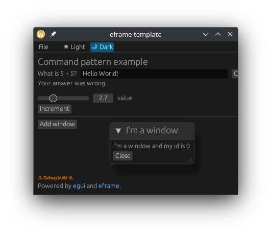

For a side project, the (security card game)[https://blog.maschmi.net/seccardgame/], I decided last year to write a
simple CLI in rust to create cards. Soon after the CLI was finished, it became clear we could need a simple GUI to
play the game and test out mechanics. Having already the basic code already in Rust, I have decided to give Rust a chance and look for a simple
UI library. My choice felt on (egui)[https://github.com/emilk/egui], an easy to use immediate mode UI. I must admit it is 
easy to use. With not much development time, we were able to try out the game by sharing a screen in a video call. However,
there were (are) basically not tests. While the game rule engine now has test, the UI has none. With a bit of time on my hands, 
I started to think about the reasons. This article will talk about one reason, and how this can be fixed.

You will find code examples in [here](https://github.com/maschmi/egui_command_pattern). There are also code snippets
and throughout the article.

## Disclaimer

I am not a professional rust developer and neither an expert in egui. If you find some wrong or strange ideas in this
article, or disagree, please get in [touch with me](https://blog.maschmi.net/about). And if you find this helpful, I appreciate
if you share this idea. Generally, I am happy to receive feedback.

Also, while this pattern is nothing fancy, I did never seen it written down for rust and egui.

## EGUI

Let us start with some basics about egui. Egui is an [immediate mode UI](https://en.wikipedia.org/wiki/Immediate_mode_(computer_graphics)#Immediate_mode_GUI), which means
we specify all the UI elements in the update loop together with their values. A retained mode GUI would need us to store a reference to an UI element and then call a method
on this UI element ot update its value. You can read about the pros and cons in the [egui readme](https://github.com/emilk/egui?tab=readme-ov-file#why-immediate-mode). For us
it is important to remember the following facts:

* we have a thread which draws the UI every frame — we should not block this
* we have one update function in which we define the GUI
* as long as the frame rate is high enough, we most likely do not have to force a re-draw when the user clicks a button

## Basics and State



We can start using the [eframe template](https://github.com/emilk/eframe_template) which gives us a small app on which we can
start to build on. As this is not a tutorial, I will not go over the changes I made step by step. In short, I have changed a label,
added a `Check` button and a place to display the result. I have also added a button to create a new window inside the main window. 
The implementation is not very robust and certainly not an optimal one, but it will help to understand the point I am going to make.
Can you spot the issue with the window IDs in the [code](https://github.com/maschmi/egui_command_pattern/blob/main/src/app.rs)[Hint](#window-id-hint)?

The main function inside `main.rs` calls

```rust
    eframe::run_native(
        "eframe template",
        native_options,
        Box::new(|_| Ok(Box::new(egui_command_pattern::CommandPatternApp::new()))),
    )
```

and creates a new `CommandPatternApp` struct. This struct looks as follows

```rust
pub struct CommandPatternApp {
    // Example stuff:
    label: String,  
    correct_answer: Option<bool>,
    value: f32,
    windows: Vec<WindowContent>,
}
```

together with the `update` function signature   

```rust
impl eframe::App for CommandPatternApp {
    /// Called each time the UI needs repainting, which may be many times per second.
    fn update(&mut self, ctx: &egui::Context, _frame: &mut eframe::Frame) {
        Self::create_top_menu(ctx);

        self.create_central_panel(ctx);
    }
}
```

it becomes clear, that this `CommandPatternApp`struct holds the state of the application. This also means, every time
a user interacts with a control, e.g. enters text, we need to update the state which then will be used in the next iteration
to draw the updated GUI.

## Reacting to user interaction

Let us have a look at the input field with the `Check` button.

```rust
ui.horizontal(|ui| {
  ui.label("What is 5 + 5?");
  ui.text_edit_singleline(&mut self.label);
  if ui.button("Check").clicked() {
    self.correct_answer = Some(10 == self.label.parse::<i32>().unwrap_or(0));
  };
});
```

In a horizontal layout (row) we add a label, then a single line text edit field with a mutable borrow to the `label` field of our
state struct. Every change in the text edit will be written into this field and be available in the next iteration of the update loop. Then we
add a button with a click handling. When the button is clicked we update the `correct_answer` field of our state struct. This field is later used
to print a label underneath this row.

This is really, straightforward. Right? However, this is also a bit of a problem. While one can debate if and how we should test
the binding of `self.label` to the text edit field, we should certainly be able to write test our validation logic determining if 
our answer is correct or not.

One simple solution would be to move this line in to its own function and then write a test for it. However, then you will still have
multiple places in your code which are called when a user interacts. Also, there is nothing convening the intent of the user interaction.

## Commands

I do not like to have multiple places where, similar functions are called. Maybe when a project grows, the same logic is implemented
multiple times. I also do not like to have to know where to look for user interaction handling code. It could be all over the place. And it
also may not convey a semantic meaning. Can we make this more self-documenting and clearer?

How about using something like [this](https://github.com/maschmi/egui_command_pattern/blob/command_callback/src/command_handler.rs) 

```rust
pub(crate) enum Command {
    VerifyAnswer(String),
    IncrementByButton,
    CreateNewWindow(WindowContent),
    CloseWindow(usize),
    NoOP,
}

pub(crate) trait CommandHandler {
    fn handle_command(&mut self, command: Command);
}

impl CommandHandler for CommandPatternApp {
    fn handle_command(&mut self, command: Command) {
        match command {
            Command::VerifyAnswer(answer) => {
                dbg!("Handle verify answer command");
                self.correct_answer = Some(10 == answer.parse::<i32>().unwrap_or(0));
            }
        _ => { /* all the other commands */ } // do not do this in production code, there you rely on exhaustive pattern matching
    }
}
```

Now we can rewrite our button click handling like this:

```rust
if ui.button("Check").clicked() {
  let value = self.label.clone();
  self.handle_command(Command::VerifyAnswer(value));
 };
```

We now convey the intent of the interaction as well as centralize the logic for state modification at one place. Also we
document all the commands a user can perform in the `Command` enum. A new developer (or myself in 4 weeks) can now look
at the `Command` enum and see immediately which interaction should be possible - your IDE may help you find where these
commands are created and therefore used. Also, there is a single function we can write tests for and the compiler helps
us check if we have unhandled commands.

That is the basic idea. Most likely, nothing new and rather simple.

## Callback functions

This `self.handle_command` call can get a bit problematic if we have windows which are not part of the `CommandPatternApp` struct
and therefore have no `self` reference. As long as the new window is created in a instance method like in [here](https://github.com/maschmi/egui_command_pattern/blob/command_callback/src/window.rs),
we simply can call:

```rust
fn add_close_button(&mut self, content: &WindowContent, ui: &mut Ui) {
  if ui.button("Close").clicked() {
    self.handle_command(Command::CloseWindow(content.id));
  }
}
```

and be happy.

But what if the window is created by a static method like this:

```rust
pub(crate) fn create_window<F>(cmd_callback: &mut F, ctx: &Context, content: &WindowContent)
where 
  F: FnMut(Command)
```
and we only want to supply a callback?

Then we need to modify our `draw_windows` function and supply a mutable borrow to a closure.

```rust
fn draw_windows(&mut self, ctx: &Context) {
    let windows_to_draw = self.windows.clone(); // this must be done before the mutable borrow of self happens in the closure
    let mut callback = |cmd: Command| self.handle_command(cmd);
    windows_to_draw.iter().for_each(|content| {
        create_window(
            &mut callback,
            ctx,
            content,
        );
    });
}
```

This callback closure captures a mutable borrow to self and is itself borrowed mutably by each window. Be aware, we still only
have one mutable borrow of self in the scope of the `draw_windows` functions. And also be aware, we are in a single threaded 
environment. And do not change the order of cloning the `windows` vector and creating the callback. The borrow checker will
not like it.

While we now have only on place where we handle the commands, we can take advantage of egui being an immediate mode UI and
also knowing we only have one thread.

## One call to rule them all

As long as our frame rate is high, and our users are not clicking very fast, we can simplify even more. How about putting the
command handling at a single place in the lifecycle of a frame? How about putting it directly at the beginning of the update loop.
And how about also putting not the complete window content into the app state but only the values we need?

This [commit](https://github.com/maschmi/egui_command_pattern/commit/e7841ec283773282dc7ec46a6429d21e142a917f) changes the
`CreateWindowCommand` to only getting the window id and moves the content creation into the loop inside the `draw_windows` function. It
also fixes the issue with the window ids.

But how about putting the command handling call into one place? Well, assuming we have a high enough frame rate (one update iteration does
not take too long) and knowing we only have one single thread, we can modify our state to hold a

```rust
pub struct CommandPatternApp {
    // other stuff...
    pub(crate) cmd_to_run: Option<Command>
}
```

`cmd_to_run` field which is read as first instruction of the update loop

```rust
if let Some(cmd) = &self.cmd_to_run {
  self.handle_command(cmd.clone())
}
```

Now we have one place where all the state changes happen (the `handle_command` function) and a single place where we can
check if a user interaction triggered a command. At least for me, this looks much more understandable and testable than the
first implementation where the state mutation was done in place and all over the code.

## Conclusion

We have seen three possible ways to handle state changes on user interaction inside egui. The first one, performing the state
change directly where the element (e.g., button) is defined works well but is not easily testable nor conveys intent. The second patter
introduced Commands, creates them when a user interacts with an element and then calls a function to handle the commands. This centralizes
the state change, decouples it from the element definition, conveys intent and makes the intended stat change easily testable. We also have seen how to
supply this `hanlde_command` function as a callback to function outside the `CommandPatternApp` implementation.
Last but not least, we centralized the place where the `handle_command` function is called to a single place in the application.

Both, the second pattern and the third pattern convey intent and make the state change followed by a user interaction easily testable. Personally, I favor
the third method over the second as we then only have a single place changing the state. However, this may result in issues when
a user happens to trigger two commands during one update iteration (e.g. low frame rate or long-running commands). We could then work with a vector of commands 
instead of a single field or start to force a redrawing when a user interacts with an element. However, I feel these are issues not of the shown patterns but more
of using an immediate UI.

## Code

You can find all the code in this [repository](https://github.com/maschmi/egui_command_pattern). The branches contain the following:

* [main](https://github.com/maschmi/egui_command_pattern/tree/main) contains the basic implementation
* [command_callback](https://github.com/maschmi/egui_command_pattern/tree/command_callback) contains the code with the command callback
* [non_self_windows](https://github.com/maschmi/egui_command_pattern/tree/non_self_windows) the code where the windows are not created in an instance method
* [one_call_to_rule_them_all](https://github.com/maschmi/egui_command_pattern/tree/one_call_to_rule_them_all) the code where we call the command handling at one place only

Tests are only included int the [one_call_to_rule_them_all](https://github.com/maschmi/egui_command_pattern/tree/one_call_to_rule_them_all) branch.

### Window Id Hint

Crate two new windows and close the one with ID 0. Then create another one and count the windows.


