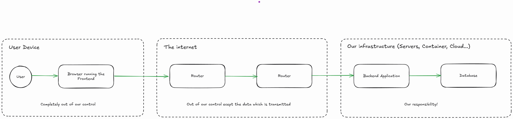

Lately I heard a colleague tell an intern how important it is to hash user passwords. I was delighted as I heard this. Until.
Until I realized they were talking about a web frontend and sending data to the backend. I know the colleague meant well
and didn’t want to overwhelm the intern with a more thorough explanation about password hashing and why it must be done before persisting
the data. To make matters a bit worse, it also sent me back in time when I was using a piece of software which had some security issues and was exactly doing this. 
They hashed the user entered password in the frontend with MD5 and sent it in clear text to the backend. Given the overall state of this software, I had a terrible 
feeling; my inner eye envisioned the MD5 hash stored in the database. I didn’t pursue that further at that time.

But now this overheard chat triggered me to think of it again. And made me decide to write my own piece on where and why 
you should hash a password. I will write with a web application in mind. The article is mostly to help me bring structure in my brain and
to reference it to other persons when needed. If you find an error or disagree, please tell me. 
I will not write how to hash it, use a salt and a slow hashing function and read the documentation of whatever framework you’re using. Or search for "password hashing". Or look at this [OWASP Cheat Sheet](https://cheatsheetseries.owasp.org/cheatsheets/Password_Storage_Cheat_Sheet.html)
about password storage.

## Tl;DR

Always hash a user supplied password with a slow, strong hashing algorithm and salt the hash. Never ever, store this supplied password
as it is in your database. Even if the password is not clear text or already hashed. And also always make sure to use TLS to submit data.

## Data flow

Why do we hash a password? That is easy, we want to protect the user's credentials from evil eyes, right? Correct, but where
and why do we want to do this?

Let's have a look at the flow of data.

On the user's device, the user enters the data into your website, this is done via some sort of hardware, an OS and a browser.
Then the browser submits the data via a couple of other computers to your backend. The other computers are most likely some sort
of routing devices needed to transport the data to its destination. Once the data arrives at our infrastructure, we are responsible to
pass it to the correct application which will most likely talk to a database to verify the password with some representation stored there.

We can roughly group the data by its state:

* **Data in Use**: The user enters the password and hit "send". Your application determines the correctness of the password. The database has the data loaded.
* **Data in Transport**: The data is transmitted to your application. Your application is reading data from a database. 
* **Data at Rest**: The password is persisted on your database servers hard drive and also on backup storage media

Of course, different steps could be divided further. And, at least for me, the borders between these groups can sometimes be a bit fuzzy.
But for our purpose, this is good enough. But enough of definitions, let's look at what we can do to protect the users' password.

## Threats: From what do we want to protect?

### Data in Use: User enters the password

The users enter the password on their own device. We don’t have control over this. There could be a keylogger installed,
the browser may have a malicious plugin installed, it may be malware infested, it may log the entire network traffic. In short,
we have no control about the security of the password while it is entered into the browser. We even can’t be sure the user's device
is verifying our SSL certificate. For all we know, there could be someone on the device listening to all the communication.

Does it make sense to hash the password on this device before sending it over the wire? Not much, we may be able to protect the clear text
password by being able to transform it into a hash. The hash itself could still be used to log into our backend. And when using a weak hash
algorithm, it may be also easily crackable. Of course, we could go as far as using asymmetric cryptography to protect the password. The frontend
application then will need a public key and will encrypt the password with it. The backend application knows the secret key and decrypts it again.
We need to make sure to use a different public key for each request. Otherwise, the attacker again can just replay the payload to be logged in. This
will get rather complex very fast. And even then, for all we know, the device is totally compromised.

### Data in Transport: Password is on the wire

Now it gets a bit more interesting. The user entered the password, and it is on the way to your backend application. Now there are
basically two options: We have encryption by [TLS](https://en.wikipedia.org/wiki/Transport_Layer_Security), or we don't. 

If we don't have encryption, every party involved in the transport of the data can read the password, or the password hash if we’ve decided to hash it 
in the frontend. Again, an attacker can either use the clear text password or the clear text password hash to log in via the backend application. 
The attacker only has to replay the communication. Of course, this could be made harder when we use something like CSRF token and requests need to have a 
secret generated for each request, and our backend application will only answer if the secret was correct. But this only makes it a bit harder. 
Actually, it is straightforward to write a small script acting like a browser and then just use the information from the captured traffic to log in.

The only thing which helps here is TLS. Either the very well established one on transport layer level or we need to establish our own protocol at the
application layer by sending only encrypted data. I strongly suggest not to re-invent the wheel and implement encryption on the application layer for 
this use case. As long as the key is not constantly changing and no TLS is guaranteed, an attacker may just use the encrypted payload to log in. Even worse, 
the attacker may capture a lot of packages and may try to crack it altogether. So let's assume TLS is in place. 
Now it comes down to trust. Do you trust the TLS protocol and the certification authorities (CA)? CAs could issue certificates to malicious actors 
which may be valid for your domain and which may be trusted by the user's device. Then the TLS encrypted traffic would be clear text to the attacker holding 
this certificate. If you decide, you can’t rely on the CAs to be trustworthy we enter a complete new problem space. A space which I don’t feel competent to write about. 
Then it comes down to cryptography. And cryptography is hard. So let's assume the CAs are trustworthy enough. Your server and the users browser do the whole handshaking 
and establish an end-to-end encrypted connection. Even the clear-text user password will be safe from prying eyes then.

### Data in Transport: Password enters our infrastructure

Now we enter the realm where we can actually act. The traffic reaches our infrastructure. Somewhere there is a system which terminates the
TLS traffic. This could be our backend application directly, this could be some gateway like e.g. a kubernetes ingress or an API gateway. 
After the TLS termination, we need to be sure to be either in a trusted environment (most likely not) or the data has reached our backend server. 
If we aren’t in a trusted environment, e.g., in shared networks like a cloud or kubernetes cluster, it comes down to reading documentation and trusting the people
running the infrastructure. As long as we don’t know for sure (or trust enough) we must assume the traffic is in clear text and may be read by third parties.
The question we then have to answer is, how high is the risk of someone listening in? And if we deem it a significant risk, we must think about how to minimize that risk.
Maybe we need to make sure to terminate the TLS connection right in our backend application. Or we can use kubernetes service which enables TLS. Or our provider allows  
enabling extra encryption inside the cluster/cloud. 

But do we gain extra security by sending a hashed password over the wire? Again, the answer is no. The same attacks as above are possible. 

### Data in Use: Password is in your backend application

Well, this is a wide field. A malicious actor always could get a memory dump of our running process. They then may be able to find either
the clear-text or the hashed password. While this is possible, it has not a very high probability. Also, if an attacker is able to perform this,
we might have bigger issues than keeping a password secure.

What our application now has to do is, compare the password with some stored information. For the application, it is completely irrelevant if the
information is a clear text password, a clear text hash or a salted and hashed password. The only thing the application needs to know is how to perform the
same transformation as was done when the persisted data was written. This could be a no-op keeping it as it is, a simple hashing algorithm, something custom-made or
a hashing algorithm especially designed for such a use case. Most of those special password hashing algorithms are slow. This may sound counterintuitive at first, but it will
make sense.

### Data in Transit: Communication with the Database

Well, this happens in your infrastructure. The same principle as when the password enters your infrastructure apply.

### Data in Use: Data loaded by the Database

Now we do a bit nit-picking. When our database is running, the database must have access to the data. So anyone who can send
queries to the database can read the data as well. This especially includes dumps. And this is one of the reasons your database shouldn’t 
store clear-text passwords or hashes which were sent over the wire. An attacker dumping this information could then use the password or hash
to impersonate a user. And furthermore, the attacker can use the clear-text password together with other information, like username or email, to
check other services for password reuse. This gets a bit harder if you only store the transmitted hash. The attacker has to crack that hash
first before checking it for reuse. And it gets a lot harder if you only store salted hashes created with a slow hashing algorithm. Its harder and slower to crack then.

### Data at Rest: Hard drive and Backups

This is just another source of possible data leaks. If our hard drive and/or our backups aren’t encrypted, an attacker with
access to them could just copy the data and do whatever they want. Think of misconfigurations in file shares for backups or
hardware thrown into the garbage or being stolen. The same as above holds true: If the password is hashed with a salt and a slow algorithm, 
the attacker needs more time to crack the passwords of the users. And if your backend application is doing the hashing, the attacker can’t
use this hash to authenticate. The hash would then just be hashed again and authentication will fail.

## Hashing before sending

You may ask yourself if you should hash the password before sending it over the wire or not. Well, ask yourself what exactly it is you 
want to protect. 

Do you want to protect the user password, even from our application? Then hash it with a strong hashing algorithm and make sure
your backend uses this hash to hash it again, like a password, before persisting it. Do not, and I can’t emphasize this enough, do not 
take the transmitted hash and use it to compare against. Once data is leaked, all accounts will be compromised instantly. Always hash the password before persisting it. And a
transmitted hash is nothing more like a password in a transformed shape. 

If it is okay for our application to know the user password, don't hash it then before sending. But always make sure to hash it with a password hashing algorithm before storing it.

## Only store hashes which didn’t went over the wire

And just to emphasize it again: Don’t store anything as password in your database which was sent over the wire. Always hash it, use a salt
and a slow algorithm. Always. Never ever should there be a clear text password in your database against which your application compares the user
entered password. Never.

## Disclaimer

I do not consider myself an expert on this topic. If you disagree or find an error, please tell me.
And if you do think about security, please do it with at least two people. Nothing helps better than a discussion.