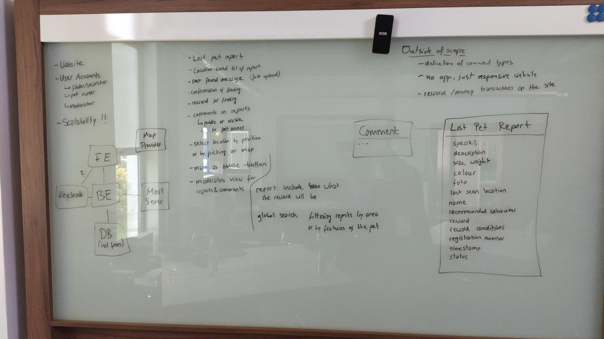
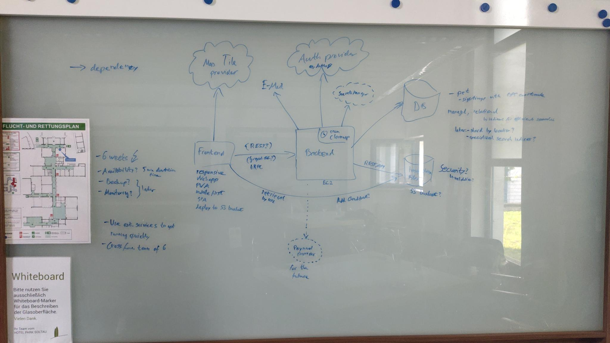

Again, another year has passed and I found myself back in Soltau. This time with a little twist. I applied for a training day slot and got in. I would never have thought I might find myself in such a spot. This only happened because people I met at SoCraTes encouraged me to do so. Thank you for this encouragement!

Writing about SoCraTes this year poses a bit of a challenge. There was so much happening. Not also did we had great talks, I also learned some things about myself and met some very kind and caring people. Therefore I will not do a chronological run down. Yet I will start with the training day.

## The active part

Last time I found myself co-hosting two session. This year I found myself giving a [git training](https://maschmi.net/git-training), co-hosting a session on the security card game [Lisi](https://www.linkedin.com/in/lisihocke/), [Philip](https://www.linkedin.com/in/philipp-zug-a892161b/) and me are working on, and thanks to [Frank's](https://www.linkedin.com/in/franksons/) enabling session running an [architectural kata](https://www.architecturalkatas.com). What shall I say, all of those were valuable, had some learning opportunities and I had a good feeling about it.

### The git training

I never had thought I will be giving a training anytime soon at an international IT conference. Yet, it happened. Last year I asked around if there is interest in a git training. This year in January the organizers contacted me and asked if I'm willing to give one. I agreed. What shall I say. It was way more work than I had anticipated. I learned a lot about git during the preparation. Some things new, some things I learned again. At first I thought, I will never fill two hours. Then I thought, I will never fit anything useful into this short period. It became apparent I had to create modules for different topics and also let the people choose some of them. The hardest part was, not knowing exactly how experienced the attendees would be. A while into the preparation I decided to create a complete [web-site](https://maschmi.net/git-training/) for the training. Every module and every exercise are on there. In the training we did not do any of the exercises and did not cover all modules. Feel free to use this resource as you see fit. However, I put it under a rather restrictive creative commons licence, contact me if you think you need specific consent.

The session seemed to run okay. Even, or maybe especially, as I at least twice had to correct me and also had to admit to not know some things. To all who have already gave me feedback: Thank you! It was overwhelming positive. I'm curious if there is official feedback on its way to me.

Lastly, I need to thank colleagues, friends and at least one person who became some sort of unofficial mentor for me. This would not have been possible without your critique and also without your encouragement. I would never have dared to do something like this.

### The Security-Card-Game

Two years ago, [Lisi](https://www.linkedin.com/in/lisihocke/), chaired a workshop on security. During this workshop an [idea about a security themed card game was born](https://blog.maschmi.net/seccardgame/). Since then, [Lisi](https://www.linkedin.com/in/lisihocke/), [Philip](https://www.linkedin.com/in/philipp-zug-a892161b/) and me are working on it. We also had some help from [Julian](https://www.linkedin.com/in/julian-michelmann/) for some time after lasts years SoCraTes where we showed it the first time to the public. This is a very slow paced, leisure project. It felt like not much happened during the last year. Anyway we decided to host a workshop this year on Sunday. We again got some new ideas for cards and mechanisms. We actually played two rounds. One to introduce the game itself, and one to test one of the scenarios [Lisi](https://www.linkedin.com/in/lisihocke/) created. At least I was surprised when actually two attendees wanted to use the game for their work. One of them was [Thierry](https://www.linkedin.com/in/tdpauw). They even [proposed](https://www.linkedin.com/feed/update/urn:li:activity:7352716279146770432) to use it in or as a workshop. Wow, that felt very good.

You can find the [game cards](https://github.com/Security-Card-Game/securityDeckGame) and the [software](https://github.com/Security-Card-Game/seccardgamecli) on GitHub. Thank you [Philip](https://www.linkedin.com/in/julian-michelmann/) for chairing this session on short notice!

### Architectural Kata

I'm currently reading ["Fundamentals of Software Architecture - An engineering approach"](https://fundamentalsofsoftwarearchitecture.com) by Mark Richards and Neal Ford. They mention the concept of katas for architecture. While a coding kata is well established, I never did one on architecture. As so often, I could not hold myself back and asked in the conference discord if there will be interest in such a thing. Surprise, it was. But even better, [Frank Sons](https://www.linkedin.com/in/andrewharmellaw/) already facilitated some and gave a short session on how to facilitate such a kata. As he had to leave on Sunday I offered a kata myself. Thank you Frank! Without your introduction this would not have been easily possible for me. We did the kata on a [pet finder portal](https://www.architecturalkatas.com/kata.html?kata=WheresFluffy.json). I got lucky and had two teams approaching the task quite differently. From my expression both did very good. And the best part: We learned all from each other! In the end, the combination of both results would be a very good starting point. Thank you for that experience and letting me observe you tackling this problem!

As the one facilitating this kata I had tremendous fun treating it a bit like a improv session, switching into different roles. I was very happy I took notes of my answers to questions, so I was consistent in them. A learning for me was, when setting the stage I should not only have a context ready but also may tell the teams it is okay to go deeper than the coarse level, but there is no need to. And I should introduce the [C4-Model](https://c4model.com) to facilitate this type of thinking. Actually, I'm looking forward to facilitate those more often. And of course, I want to take part in them myself.

## The not so active part

Of course there were some great sessions to attend. On the training day I attended [Avraham Poupko's](https://www.linkedin.com/in/avrahampoupko/) lecture on "Digital Dominoes: Understanding Modern Security - From Supply Chain Attacks to the life cycle of a vulnerability" and [Diana Larsens's](https://www.linkedin.com/in/dianalarsenagileswd/) workshop on "The Evolution of Team Co-intelligence: From Knowledge Work to Learning Work". I did very much liked Diana's mention on the evolution of high performance teams to, if I remember correctly, true agile teams. I also liked the term co-intelligence a lot. It feels like something which can emerge from a group of people and persists of collective intelligence, collaborative intelligence founded on trust and is learning centered. I will for sure keep my eyes open to identify such things. And I will try to foster them.

On the first open space day I attended [Marco's](https://www.linkedin.com/in/marco-emrich/) showcase of "MAD-TDD" (Mob-AI-Driven TDD) and learned how an AI can be coerced to do TDD. [Lisi](https://www.linkedin.com/in/lisihocke/) then hosted a session on "How to build secure enough products" where we tried to find bumps and boosts in creating secure software. After lunch [Corstian](https://www.linkedin.com/in/corstianboerman/) gave a session on how he received a strange packaged with an USB stick inside which appeared empty but was not and how he entered the rabbit hole to find out what is going on. Very interesting talk, with a lot of learnings in it. You can find his [slides online](https://disintegrated.parts/notes/conferences/socrates/stickyness-redacted.pdf). After that [Markus](https://www.linkedin.com/in/markustacker/) hosted a session on "Modelling out the monolith" where he gave a real world example and the problems he was running into. This was very informative and reassuring on the idea of architecture as a process. The last session of the first day was hosted by [Andrew](https://www.linkedin.com/in/andrewharmellaw/) and had the title "What does non-patriarchial software development look like". While this was an interesting session, it was also one who had me flee into the forest for an hour afterwards to be alone with my thoughts.

The second open space day, started with an introduction on architectural katas from [Frank](https://www.linkedin.com/in/franksons/). It is a bit of a pity I missed [Andrew's](https://www.linkedin.com/in/andrewharmellaw/) session on "The Architecture Advice Process - Intro and How to Get Going", but there is a [video](https://youtu.be/fNIztIQWa04?si=ONJjmnpbZ_c_gE2D) on the idea online - now I only need to watch it sometime. This was followed with a session on "Navigating Spaces" where it was asked for advice on how to navigate default and queer spaces. This was an unexpected session for me. It turned kind of in a self-help discussion. While I do not identify myself as queer I do certainly have troubles navigation default space and social situations. Thank you for that session. After this, I should have known better then going to the session about "Serendipity" by [Nina](https://www.linkedin.com/in/nina-schulz-84711027a/) after lunch. Don't get me wrong. The session and the topic were great. I just realized something during that session and by speaking it out loud it disturbed me in a way I actually had to leave the session and go somewhere else to take my brain off it. If you are interested in the concept and either can read German or use a translation tool, Nina wrote an [article](https://t3n.de/news/kunst-un-geplanter-erfolg-gehirn-zufaellige-geistesblitze-1679827/) about this topic. I switched to "Prompt Injection" which was hosted by [Jan](https://www.linkedin.com/in/jan-gregor-triebel) and used Lakera's [Gandalf](https://gandalf.lakera.ai/baseline) as examples. It was quite interesting seeing the group coming up with ideas. The last session of the open space I attended was [Lisi's](https://www.linkedin.com/in/lisihocke/) "Getting into security - career options" which actually got me thinking about some things.

## Security at SoCraTes

If you read carefully you might have already guessed I'm interested in security. Lucky for SoCraTes (and me), [Lisi](https://www.linkedin.com/in/lisihocke/) attended the conference again this year. The last years she already was **the** security person and hosted sessions and capture the flags during the nights. This year, there were again two capture the flag sessions till late in the night. Both of them were a lot of fun. And at least, I learned (again), it is not a good idea to do deobfuscation manually when everybody is very very tired. While the error in the encryption key lead to an error, the mistake in the encrypted message let to strange output which first led us all to investigate encoding issues. Thank you [Lisi](https://www.linkedin.com/in/lisihocke/) for hosting those session and also creating such an open atmosphere in them.

Those sessions had a big impact on me. I finally got infected last year and decided to spend some time learning how to perform penetration testing. While it makes a lot of fun, it is also very daunting. It is such a broad field. So many tools, so much knowledge, so much creativity needed. This year, on Sunday, two people asked me if I do penetration testing at work. No I do not do this, also I'm not sure if I want to or can do this professionally. However, it was great feedback, came at a crucial time and also got me thinking about some things.

And before I forget this. There is an open space security conference happening this year for the second time. It will take place from October, 2nd to 5th in Rückersbach (Germany). It is called [open security conference](https://opensecurityconference.org). At least two persons from the organizers were present in Soltau: [Janina](https://www.linkedin.com/in/janina-nemec-39875316a/) and [Lisi](https://www.linkedin.com/in/lisihocke/).

## The more personal side

This might be the most surprising part of this years SoCraTes for me. However, I feel it is important as well. If you read till here, you might have noticed I wrote about the need to either go into the forest to be alone with my thought, had to leave a session early or sometimes struggle with the default world and social situations. While this happens from time to time, while I do know how to deal with this most of the times, it came to situations where I felt very anxious. One good thing about this conference is: No one asks any questions if one does not join a table but wants to eat alone. Another good thing is: There are people there one can talk to. Thank you all. I sincerely hope you know who you are.

I also want to share another social situation with you. On Sunday evening, the hotel started to fill up with tourists once again. The atmosphere changed. But, a group of us were sitting around a table and talking. Not much about tech. It felt like sitting at a table of friends. Thank you. And also thank you [Raimo](https://www.linkedin.com/in/rradczewski/) for the session on the rules of pool billiard - it was nice to learn them and they make the game so much more manageable for me then the bar rules.

## A note of thanks

Thank you [QualityMinds](https://qualityminds.com/de/) for sponsoring this year's conference and also for sending me there. Even though, I prepared the training session in my spare time.

And to all the people who attended: Thank you, this is such a wonderful event! It felt so wholesome. Most certainly I have forgotten to mention some people I have learned from.
Please forgive me.
I hope we meet again next time.
