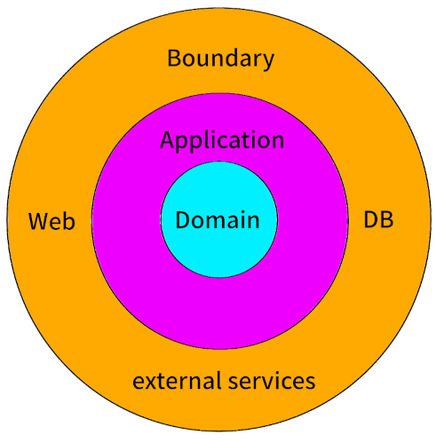

I must confess I tried to write this article for quite a while now.
I even had two drafts ready. 
Both read more and more like a rant.
Upon a bit of introspection I realized the reason they were turning into ranting.
The reason is simple: I am deeply unsure if the architecture I describe to you in the following has an issue or if I just personally disagree with it.
You might take the title as a hint of my unease.
To be upfront: I am quite sure the rotten onion architecture is not called that way elsewhere.
I just named it that in my head.
And now in this article.

## Onion Architecture

Let me set the stage.
Since a few years I try to use domain-drive-design in projects. 
Not in every project, but in the ones that lend themselves to it.
And I usually tend to use a onion architecture style.
Why not hexagonal you may ask.
Well, I made the experience when I try to use a hexagonal architecture it often gets to formal.
Suddenly your codebase explodes with ports and adapters.
In my opinion this might not be necessary.
As always, this depends on the team and on the project.
In my opinion, explaining an onion architecture conveys the most important points.
Your domain model sits at the center, you can have domain- and application-services.
And you have to have a boundary.
In the boundary all your external connections reside.
Be it web controller, code that calls external services or code that handles the persistence.
Every onion ring must only depend on a lower ring.
Meaning, your domain must not use services or data models from the boundary or the application ring.
For example, a DTO used in a web controller must not be used in the domain model.
This simple rule leads to the introduction of anti-corruption layers (ACL) between the rings.
This comes at the cost of mapping but gains the ability to change your API or your lower levels without affecting each other much.
The ACL will have to do the work and be adapted to the changes.
You can evolve different parts of your application much easier.
Just make sure they do not grow too much apart.
Neither by code nor by naming.

Together with things like inversion-of-control and the rule of thumb to split DTOs sending data to external services from the ones used to receive data from external services this already takes one a long way. 
Fill it in with concepts like bounded-context and aggregates from domain-driven-design (DDD) and in my experience you are at a great place to start a project which is not a simple CRUD application.
And in my experience, a lot of projects start as CRUD application but evolve into something different as requirements change.
Think twice if someone tells you they only need a CRUD application. 

But I am veering off the topic I wanted to write about. 
Creating an onion architecture will put your persistence layer into the boundary.
Ultimately this will lead to an ACL and hence mapping between domain entities and persistence objects.
And this is where things are getting interesting.

## The Rotten Onion

If you are, liken me, working in an enterprisy context and within the Java ecosystem you will know the Hibernate ORM (object-relational-mapper).
ORMs are not a stand alone feature of this ecosystem, .NET has the EntityFramework, Python SQLAlchemy and others.
ORMs try to map your object model to a relational database model and vice-versa.
Some ecosystems have standards like the Jakarta Persistence API (JPA) in Java, where Hibernate is an implementation from.
There even might me additional layers of abstraction build on top of it, like SpringData.
I try to keep the points I am going to make as JPA free a possible.
This may not work well sometimes.
But I am quite sure some, if not all, of the points translate to other ORMs as well.

Before I dive into the rotten onion, I must disclaim I have a love-hate relationship with ORMs.
They help if you are working with relational databases.
They also tend to create a bit of confusion, sometimes stand in the way and also lead to the rotten onion.
And there always looms the question if one just did not use a NoSQL database because the whole team is very familiar with the ORM. 
Is the team locked in by missing knowledge and experience?

But what is the rotten onion? 
The rotten onion is when one decides to merge domain and persistence entities.
ORMs make this very tempting.
Just annotate your model with things like `@Entity` will allow you to map this directly to a database table and also columns.
Using things like `@OneToMany` even allows you to define relations.
And the best is, the ORM will take care of loading relations when needed.
One can still define a repository interface in the domain and implement this in the boundary.
Tempting.
One does not need to take care about mapping.
One can rely on the standards and frameworks like JPA and SpringData.
After all, they are widely proven and everybody seems to use them.
Right?

Welcome to the rotten onion.
Now the domain entities have two responsibilities: They define business behaviour and data structures, and they also define the database structure.

## The mixed entity

To be fair, for simple models this is not an issue.
Even for more complex ones this is not an issue at the beginning.
It feels smooth.
It feels fast.
First.

And then slowly problems may arise.

### Direction of relationships and lazy loading

Imagine the following: A blog post as your root entity (aggregate) which contains a list of comments (entity).
In your domain model the comment is part of the aggregate.
There is no way to retrieve comments without going through the post repository.
For performance reasons one will most likely decide to lazy load the comment collection from the database.
The ORM will load the comments when needed.
This may lead to exceptions when this is done outside a transaction.
One issue here is, with only the domain entity in hand there is no way to know if the comments are already loaded.
Another issue is, for your ORM to be able to load the collection lazily the comments need to know their parent.
They need to hold a reference to a post.
In the domain model, one will now have a bi-directional relation.
No matter if was wanted, needed or should not be there.

In this simple case, one could try to make a decision and think about the probability the post is ever needed without comments.
If this probability is low, one can use eager loading and tell the ORM to fetch this collection always.
This may work for a single collection.
If the domain object gets more complex this may lead to a serious performance hit.
Lazy fetching is there for a reason.

If one opts for a clear separation of concerns. One could keep all this data retrieval decisions in the boundary.
The persistence boundary should handle this.
The domain repository may have methods in it like `loadPostById` and `loadPostWithCommentsById` resulting in a `Post` or in a `PostWithComments` object.
This first may feel strange.
However, it is very clear what one has in hands when dealing with the domain object.
The `Post` object may even still hold a `addComment` method.
And the `PostWithComments` may simply be a decorator of the `Post` object adding a comments collection.
One can do performance optimization in the persistence boundary.
One could create a factory method inside the `PostWithComments` accepting a `Post` which loads the comments.
Certainly one has more freedom and flexibility in implementing the domain model.
But yes, it comes at a price.
Here the price is more objects and most likely unfamiliarity.

### Collections of value objects

Let's stay with collections. In JPA you can decide to have either an `@OneToMany` relation or an `@ElementCollection`.
The `@OneToMany` collection mandates the usage of `@Entity` on both sides.
`@Entity` mandates an `@Id` and imposes a life cycle on the object.
This is fine if one does not deal with value objects.
A comment will have a life cycle, editing, deletion and so on.
Here a `@OneToMany` is the right choice.
But what when it comes down to value objects?
Object without a life cycle?
Then one will most likely use an `@ElementCollection`.
On the database level this is not very different.
Both ways result most likely in a table with a foreign key to the parent - post in our case.
But the behaviour of the ORM might differ quite a lot.
When given an update of an element in an  `@ElementCollection` at least Hibernate will most likely write the complete collections.
The ORM does not know which element to update.
Yes, there are ways around this.
Like imposing and order with `@OrderColumn`, this will lead to a composite key of `order_column` and `parent_id`.
Or even adding a technical ID to the vale object.
But again, this is a detail of the persistence.
Why should your domain entity care about this?

### OneToOne relations

In a domain model an aggregate will often hold things like an `Address` or similar. 
This is often modelled into an own object.
Or one just decides to nest objects to make a data structure more clear.
When the domain and persistence entity are the same, one must now decide if this data will live in the same table or a different one.
Keeping it in the same table will increase the amount of data loaded from the database every time the entity is loaded.
Moving it into another table will introduce a `@OneToOne` relation.
And at least with Hibernate `@OneToOne` mappings can be a bit tricky when it comes to lazy loading and performance.
Again, when using a merged persistence and domain model puts one into the situation where one has to think about both models at the same time.

### Optional relations and properties

When not choosing a `@OneToOne` mapping but using an `@Embeddable` to model an optional relation one will introduce a lot of nullable fields into the domain entity.
There is no way for the ORM to either map this to an `Optional` or nullable property. 
One will have to do this manually. 
And the domain entity of which the embedded object is a part of will have nullable properties.
The ORM will not know it the data in the database is inconsistent with the domain model.
It will happily add values to some of the embedded object properties and not to others.
Even when the domain model clearly states they must either be there completely or not at all.
When dealing with inheritance this can get even worse.

### Encapsulation

The only way a domain entity should be modified is by its own methods.
Again, imagine a collection inside the domain entity.
Most likely one wants to access this collection at some place.
And at least I feel better if this access is - at least for the collections itself - immutable.
If it is immutable I and others cannot by accident remove or add an element somewhere in the code.
And no one has to worry if the change is written back to the database at the end of a transaction.

Chances are high an ORM will expose mutable collections. 
Now one has to implement specific getters for that collections.
Granted, in Java one will need to do this anyways.
But looking at Kotlin or C# with properties and their accessors this feels a bit clunky.

### Initialization

While all the above things are clunky but can be overcome, this is the part where I struggle the most with ORMs.
Imagine a domain entity which needs additional logic.
Which one is decided at runtime.
Easy, right.
Just put an interface into the constructor and inject the correct implementation when it is initialized.
Well, not when one uses an ORM.
As the data is not in the database it cannot be initialized when the ORM creates the domain object.
This is a real hard limitation when one has merged behaviour, domain data and persistence model into one object.
This is the place where the rotten onion breaks for me completely.
I now have to jump through hoops to make sure my domain entity is completely initialized.

### Writing changes back

This is the place where ORMs shine.
They load data from the database, create an object and start a life cycle.
As long as the object is managed, changes will be propagated to the database.
When putting an ACL between the persistence entity and the domain entity this will get a bit more complicated.
One will need to first load data, map it to a domain entity, then map the domain entity back to the persistence model and write it to the database.
A doable way could include reloading the data first, then mapping the domain entity or only the changes to the persistence model.
Most likely, the ORM will have kept the persistence entity in a first level cache as long as the transaction is open.
No extra database call will be issued.
While this is a solvable problem, it need thought to it.
And it makes splitting domain and persistence entity harder to defend and also harder to do.

## Alternatives

Of course there are alternatives: 

* One could ditch ORMs altogether and resort to SQL-Queries and projections.
* One could ditch relational databases in some cases - this will impose other issues, but it might be worth it.
* One could put all the business logic into services and ditch DDD altogether.

## Is the rotten onion bad?

Honestly, I do not know if merging domain entities and persistence entities is bad.
It all depends on the team working on the application and of course the application itself.
Further, it depends on the business context.
Is there time to refactor later?
Is there time to learn?
Is the application bound to get more complex?

Personally, I would try to keep persistence data and domain data model separated and would rather deal with the additional mapping.
Then one can optimize where one needs to.
And one can refactor the domain completely without the need to migrate the database structure.
Again, this does not state the database structure will never have to be changed or migrated.
But the impact of each change is more isolated.

I am curious on your takes on this issue. Maybe it only exists inside my head. Maybe you asked yourself similar questions. Let me know. We can only learn through exchange and communication.
