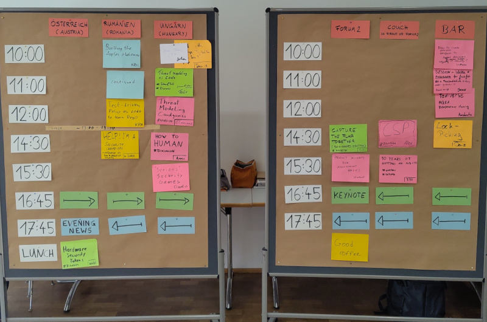
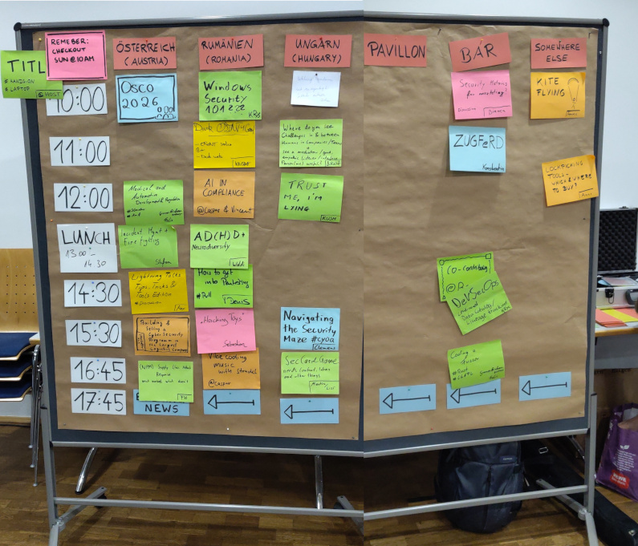

This year it happened. I just joined my first security conference. It helped to know it was an open space format. 
And it also helped very much to know some [organizers](https://opensecurityconference.org/about/team/), at least by sight from the SoCraTes conferences in Soltau. 
Special thanks go to [Lisi](https://www.linkedin.com/in/lisihocke/), she advertised this conference warmly and suggested I might like it there. Well, I did trust her with that, and the trust was not misplaced.

I already said it [elsewhere](https://mastodon.social/@inw/115323417063052766): It was an amazing long weekend. A huge thanks to the organizers who made this possible!

## Overall experience

Before I dive into a chronology of the talks I went to, I want to share some thoughts and general experiences.

It was an open space conference. 
This means there is no schedule known in advance. 
All the sessions are announced by the attending people on the morning of the conference day.
I think this is a great format.
Get people willing to share and learn together, give some structure and see what happens.
And it happened a lot.

For me, as a software engineer, OSCO was a great place to get into touch with people from the security side of the field. 
Researchers, defenders, attackers and other software engineers.
This is by far not normal.
Reasons I never joined a pure security conference is they are either too specialized or judging by the schedules too deep into it.
And of course, they are expensive.
With OCSO, nothing of this holds true. 
As it is with open spaces, there was no schedule known in advance, and there is always the possibility to propose a pull session and just ask for ideas and answers to questions.
Most of the time there will be someone knowledgeable present and willing to share.
And if not, you might have a group of people having the same questions, and they help each other.
What a magical place to be.

The registration was special and thoughtful.
Of course, there were labels to write your preferred name on.
You also could add labels to indicate "no-photo" or write your pronouns on.
And then there were the sunflowers and the conversation-cards.
The sunflower was to indicate [hidden disabilities](https://hdsunflower.com), and the [communication-cards](https://www.fuchskind.de/?lang=en&nav=download) for neurodiverse people.
What a nice touch.
At least the sunflowers were used by some people.
I did not observer the usage of the communication-cards.
But then, the crowd felt well aware of people's needs.
Maybe there was no reason to use them.
Again, compared to what is happening in the world: What a magical place to be.

The marketplaces on the conference days went smoothless.
Even the advertisements for the sponsors were not dull.
The organizers took a lot of effort to make every advertisement stick out without being annoying and feeling misplaced.
In the end the schedules for both days turned out so packed I did not find the time to attend the hallway track very much.

A personal highlight for me was meeting [Mireia](https://www.linkedin.com/in/mireiacanopujol/) in person. 
She, Lisi and I created a small CTF-team this year.
And this was the first time we ever met altogether in person.

I also had the pleasure to meet and talk to [Marc](https://www.linkedin.com/in/marckalmes/) and [Daniel](https://www.linkedin.com/in/daniel-steinhauer-791242116/) and many other people.
Those two stand out as I either know them from social media, from tales or both.

Furthermore, I need to mention how great I found the idea of not letting the conference end with the evening news on day two.
On Sunday morning there was still one room and the bar open for talking and even giving a session.
As I sometimes need some time to acclimate, the registration, and the soft ending helped me a lot.

On the way back I had lovely company on a crowded train.
Thank you for standing with me and talking in the train, even as you had reserved seats.

Overall, I had a very nice and lovely weekend. I learned new things, spent time with friends, met new people and got to know some of them. 
OSCO did show me again why I love open spaces.
There are a lot of people willing to share and to learn from each other. 
It never gets boring. 
There are so many conversations to have.
What a magical place to be.

Can’t wait for the next one!

## What others say

Do not take my word for it. 
Others also shared their experiences.
Lisi compiled a list of other posts and articles in her lovely [blog article](https://www.lisihocke.com/2025/10/open-security-conference-2025-marvelous-momentum.html) where she also shared her experiences.
I will not copy that list.
Go there and read her post. 
It is worthwhile and makes you [relieve the conference](https://infosec.exchange/@m1r314/115377613068591700).
You also can search Mastodon and LinkedIn for the hashtag #osco25 and #osco. 
I’m sure you will find some interesting posts.

## Chronology

### Day 0

This was the day everybody arrived. I had the chance to meet [Konstantin](https://weddige.eu/en/) and [Felix](https://www.linkedin.com/in/f30/) at Aschaffenburg main station and shared a taxi ride to the location with Felix.
This already set the tone. By sharing, I meant being invited. Thank you, Felix! As I was paying this whole thing out of my own pocket, I was delighted to reduce costs a bit. 
Arriving at the venue, we realized we were already one of the last ones. This usually doesn’t help with me being a bit anxious about new people and new places. But it turned out to be fine.
Registration was easy and very thoughtful (see above).

Not long, and I met [Mireia](https://www.linkedin.com/in/mireiacanopujol/) for the first time in real life and not only in a video call. With Lisi and me also there, the complete CTF-team I joined this year was under one roof. What a nice beginning.
Mireia then gave her keynote on "Building an AppSec Program from Scratch". It was insightful and told the story of how the company she is working is implementing a Security Champion program. And of where they struggled and what they learned on the way to this decision.

### Day 1

Well, every open space starts with a marketplace.

So many topics. Instantly fear of missing out showed up. My day turned out to be:

* Joining Julian in his session on the "Juice Shop CTF" where he opened a CTF-challenge for the [Juice Shop](https://owasp.org/www-project-juice-shop/). I should give this challenge another try when I'm awake.
* Listening to Felix (another Felix than the one I shared a ride with). He showed [Threagile](https://threagile.io) and [pytm](https://github.com/OWASP/pytm) as examples. Half into this session I decided I need a short break and even a nap. Nothing to do with the session.
* Next up was [Clemens](https://www.linkedin.com/in/clemens-huebner/) showing and playing Thread Modeling Card games like [Cornucopia](https://owasp.org/www-project-cornucopia/) and [Cumulus](https://owasp.org/www-project-cumulus/). This direclty lead to [me ordering them](https://mastodon.social/@inw/115360583659828801) and using them at work.
* As I had a lock-picking set, and some training locks with me, I decided to go for a lock-picking session by Denis and miss out on the session about CSPs and "How to Human".
* In the session about "Product Security Assessment Basics" by Matthias we talked about how to document product risks and why documenting decisions is important. Sometimes only to cover all the bases, not necessarily to make a product more secure — compliance vs. security. It was quite interesting to hear about this field and taking the conflicts of interests into account.
* Last but not least, [Bianca Kastl](https://mastodon.social/@bkastl) gave a keynote on "History repeating itself". It was kind of depressing to see how often we fail to learn from history. Yet again, she showed how important the environment is in changing that. 

That was the day program. I totally forgot I also wanted to join a session on raising "InfoSec awareness" and a "Feediverse QA". And well, the discussion on "Hardware Security Tokens" also slipped my mind.

In the evening [Lisi](https://www.linkedin.com/in/lisihocke/) offered a CTF session I joined. I was quite curious to see how professionals who also joined tackling such challenges. This was then followed with some hands-on lock-picking at the bar. Luckily, the bar closed at 1am, and I was kind of forced to go to bed.

### Day 2

On day two it felt like there were even more sessions.

This time I joined:

* "Windows Security 101" by [Krys](https://hachyderm.io/@krys) in where we at least succeed to start the [Hack The Box Active Directory Track](https://app.hackthebox.com/tracks/Active-Directory-Exploitation)
* "Dark OSINT" by [Kristof](https://www.linkedin.com/in/kristof-van-kriekingen-241939166) where he talked how he, and a group of like-minded people use OSINT for good. He also gave a pointer to [Trace Labs](https://www.tracelabs.org) for interested persons. Join this talk if you ever have a chance.
* "Trust me, I'm lying" was yet another highlight for me. [Kush](https://www.linkedin.com/in/kushaagra/) talked about [OODA-Loops](https://en.wikipedia.org/wiki/OODA_loop) and how to use deception to slow attackers down or even frustrate them. If you ever have a chance to hear this talk, do it.
* Next up [Denis](https://www.linkedin.com/in/denis-zygann/) asked "How to get into PenTesting" which Kristof happily answered. Kristof shared his opinion on OSCP and certified ethical hacker certifications and on HTB CPTS. He also gave tips about getting started with bug bounty programs. Quite an interesting session. Especially as I'm still trying to find the time to finish the HTB CPTS certification and it seems like I'm not wasting my time.
* [Sebastian](https://www.linkedin.com/in/sebastian-strobl-43b75128/) showed some hacking tools they use for network hacking. Thank you for all the resources you provided. Like the [WiFi Shadowapple](https://github.com/SHUR1K-N/WiFi-Shadowapple-Resources), [pwnagotchi](https://github.com/evilsocket/pwnagotchi), [Bjorn](https://github.com/infinition/Bjorn) and the [PiSquirrel](https://github.com/Hann1bl3L3ct3r/PiSquirrel).
* Last session of the day [Lisi](https://www.linkedin.com/in/lisihocke/) and me gave a session on "SecCardGame needs content, ideas and other things". We gathered a lot of [ideas and feedback](https://mastodon.social/@inw/115318472495431352). Thank you! Turned out it gave me energy to spend some more time on this.

In the evening [Lisi](https://www.linkedin.com/in/lisihocke/) yet another CTF session. 
This time we started a box where our CTF-team got stuck. The group was able to solve the box. 
I must confess, we overlooked a critical config file or at least a connection string in it when we got stuck.
Even then it did take some time, and it was interesting how others approached this.

### Day 3

The last day! What a pity. I just got acclimated. But to be honest, I was also a bit tired. 
I decided to join the "Secure Development Lifecycle Applied - How to Make Things a Bit More Secure than Yesterday Every Day" by [Lisi](https://www.linkedin.com/in/lisihocke/).
I already attended this workshop last year at SoCraTes. But as repetition is key and to do the practical parts with other people, I decided to join again. If you have the chance to join this workshop, do it.
It is quite worth the time. Thank you, [Lucas](https://www.linkedin.com/in/lucas-s-3a920229/) for your insights into Thread Modeling and JWT hacking you shared during the workshop.